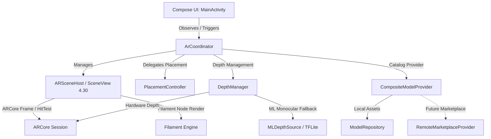

# CODEBASE — Android AR Furniture Visualizer

Authoritative technical documentation for the native Android AR Furniture Visualizer application.

---

## 1. System Overview
- **Application Goal**: Mobile AR visualizer for browsing, anchoring, and manipulating 3D furniture assets in physical environments with real-world depth occlusion and monocular ML depth fallback.
- **Primary Stack**: Kotlin 2.4.10, Jetpack Compose (BOM 2026.06.01), SceneView 4.30.0 (Google Filament rendering engine), ARCore 1.54.0, TensorFlow Lite 2.16.1.
- **Operating Target**: Android 10+ (API 29 to API 34). Physical device required for real-time GL and camera tracking.

---

## 2. Architectural Topography



---

## 3. Component Directory & File Contracts

### Root & Module Layout
- `app/src/main/AndroidManifest.xml`: Declares camera permissions, AR hardware feature requirement (`android.hardware.camera.ar`), and portrait orientation.
- `app/src/main/assets/models/`: Bundled CC0 3D furniture models (`.glb` format, `< 5MB` each):
  - `damask_purple_gold_chair.glb` (2.0 MB)
  - `glam_velvet_sofa.glb` (3.1 MB)
  - `sheen_chair.glb` (4.1 MB)
- `app/src/main/assets/ml/`: Bundled TFLite monocular depth estimation model:
  - `depth_anything_v2_small_float.tflite` (94.3 MB, `< 100MB`).

### Package: `com.arvr.app.ar`
- `MainActivity.kt`: Root activity driving camera permission state machine, ARCore availability verification, depth fallback alerts, and Compose overlay layers.
- `ARSceneHost.kt`: SceneView Compose integration. Manages `ARSceneView`, session hooks (`onSessionCreated`, `onSessionUpdated`), multi-touch gesture detectors (tap, drag, pinch-to-scale, yaw rotation), and bridges imperative `PlacementController` state to Compose snapshot state.
- `PlacementController.kt`: State-of-record for placed models. Implements hit-testing, monotonic unique ID assignment, gesture math (clamped scale `[0.1f, 5.0f]`, yaw rotation), and anchor node tracking.
- `DepthManager.kt`: Orchestrates depth sensing modes (`API`, `ML`, `NONE`). Queries ARCore `Config.DepthMode.AUTOMATIC` support and falls back gracefully to `MLDepthSource`.
- `MLDepthSource.kt`: Loads `depth_anything_v2_small_float.tflite`, allocates direct float byte buffers for `[1, 518, 518, 3]` NHWC float32 input tensors, runs inference, and returns `[1, 518, 518, 1]` depth maps.
- `CameraImageConverter.kt`: Converts ARCore camera `Image` (YUV_420_888 format) to planar RGB `ByteArray` buffers for ML consumption.
- `PermissionHandler.kt`: State machine for camera permission lifecycle (`Idle -> Requesting -> Granted | Denied`).
- `ArCoreAvailabilityChecker.kt`: Checks device compatibility against `ArCoreApk.getInstance().checkAvailability`.

### Package: `com.arvr.app.model`
- `FurnitureModel.kt`: Immutable data contract for furniture metadata (`id`, `name`, `assetPath`, `category`, `defaultScale`, `defaultYawDegrees`).
- `ModelRepository.kt`: Local asset scanner and memory cache. Validates `0x46546C67` glTF binary magic headers, ignores underscore-prefixed models, and caches byte payloads.
- `ModelProvider.kt`: Marketplace-ready abstraction defining `ModelProvider` interface, `LocalAssetModelProvider`, `RemoteMarketplaceModelProvider` (stubbed for future web fetching), and `CompositeModelProvider`.

### Package: `com.arvr.app.ui`
- `ModelPickerSheet.kt`: High-contrast bottom sheet rendering selectable models with white text over a 50% opacity black overlay.
- `TopBar.kt`: Header HUD displaying active placed model count, current depth mode, and reset button.
- `DepthToggle.kt`: Interactive toggle cycling between `API` and `ML` depth estimation.
- `CrosshairOverlay.kt`: Center reticle overlay displayed exclusively during active placement mode.
- `ErrorOverlay.kt`: Fullscreen diagnostic banner for missing ARCore or hardware errors.

---

## 4. Gesture & Interaction Mechanics
- **Model Selection**: Tapping an item in `ModelPickerSheet` enters placement mode (`CrosshairOverlay` activated).
- **Surface Hit-Test & Placement**: Tapping on a detected surface plane casts an ARCore raycast (`frame.hitTest`), generates an anchor, and binds a 3D Filament node instance via `ArCoordinator`.
- **Drag Translation**: Drag gestures on the viewport translate the selected anchor along the detected plane coordinates.
- **Pinch-to-Scale**: Two-finger pinch uniformly scales the selected model (clamped between `0.1x` and `5.0x`).
- **Twist Rotation**: Two-finger twist rotates the selected model around its vertical Y-axis.

---

## 5. Testing & Quality Assurance Contract
- **JVM Unit Suite (`app/src/test/`)**: 69/69 passing tests executing against mock interfaces (`io.mockk`). Covers state machines, gesture formulas, coordinate transforms, and repository caching. Run via:
  ```powershell
  .\gradlew.bat :app:testDebugUnitTest --no-daemon
  ```
- **Instrumented Acceptance Suite (`app/src/androidTest/`)**: AndroidX tests verifying real APK asset loading, TFLite tensor sizes, and Compose UI accessibility semantics on attached hardware. Run via:
  ```powershell
  .\gradlew.bat :app:connectedDebugAndroidTest
  ```
- **Locked Test Contract**: Test files and assertions under `app/src/test/` and `app/src/androidTest/` are immutable contracts defining public APIs and must never be altered or relaxed.

---

## 6. Build & Deployment Discipline
- **Compilation**: `.\gradlew.bat :app:assembleDebug --no-daemon`
- **Output Artifact**: `app/build/outputs/apk/debug/app-debug.apk`
- **Streaming Installation**: `adb install -r app\build\outputs\apk\debug\app-debug.apk`
- **Interactive Inspection**: UI hierarchy dumps via `adb shell uiautomator dump` and screenshots via `adb shell screencap -p`.
