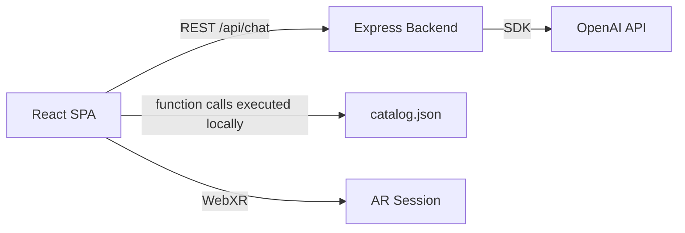

# Codebase Overview

> WebXR AR furniture visualizer with a conversational AI agent that searches a 12-item product catalog, recommends items via OpenAI function calling, and places procedurally generated 3D models onto detected real-world surfaces.

**Last updated:** 2026-08-16
**Primary language:** TypeScript (strict mode, ES2020 target)
**Architecture style:** Client-heavy monolith with serverless API proxy (Vercel)

---

## Architecture overview

The system has two runtime components: a Vite-built React SPA that owns all 3D rendering, AR session management, and AI orchestration client-side, and a thin Express backend that exists solely to proxy OpenAI API calls server-side (keeping the API key out of the browser).

Requests flow as follows: the user types or speaks a message, the client-side `AgentLoop` sends it to `POST /api/chat`, OpenAI responds with either text or tool calls, and the client executes tool calls locally against an in-memory catalog. When the AI selects a product, the `SelectedProductContext` triggers a handoff to the Three.js viewport which spawns a procedural mesh at the hit-tested surface position.

All state is client-side: conversation history lives in `localStorage`, placed models exist only in the Three.js scene graph, and product data is a static JSON file imported at build time. There is no database, no user authentication, and no persistent server-side state.



---

## Tech stack

| Layer | Technology | Notes |
|---|---|---|
| Frontend framework | React 18 | Uses `useState`/`useCallback` extensively; no React Query or SWR |
| Build tool | Vite 5 | `vite.config.ts` proxies `/api` to `localhost:3001` in dev |
| 3D rendering | Three.js 0.162 | Module-level singleton pattern in `src/xr/` — not class instances |
| AR support | WebXR API | Requires `immersive-ar` session with `hit-test` feature |
| AI model | OpenAI gpt-4o-mini | Function calling with 3 tools; 30s timeout, 2 retries |
| State management | Zustand + React Context | Zustand for placed models; `SelectedProductContext` for AI-to-AR handoff |
| Backend | Express 4 + TSX | Runs via `tsx watch`; server imports are guarded with `import.meta.url` check |
| Deployment | Vercel | Static SPA from `dist/` + serverless function from `api/index.ts` adapter |
| PWA | Service worker + manifest | `public/sw.js` caches static assets for offline use |
| Linting | ESLint + Prettier | `eslint-plugin-react-hooks` and `react-refresh` configured |

---

## Entry points

| Entry | Command | Purpose |
|---|---|---|
| Frontend dev | `npm run dev` | Vite dev server on `:5173` with HMR |
| Backend dev | `npm run dev:server` | Express on `:3001` with `tsx watch` |
| Both | `npm run dev:all` | Runs both concurrently via `concurrently` |
| Production build | `npm run build` | `tsc && vite build` outputs to `dist/` |
| Vercel serverless | `api/index.ts` | Imports and re-exports the Express `app` from `server/index.ts` |

The Express server (`server/index.ts`) only starts listening when run directly — the `import.meta.url` guard prevents it from binding a port when imported by the Vercel adapter.

---

## Key modules

| Path | Responsibility |
|---|---|
| `src/xr/ARScene.ts` | WebXR session lifecycle, Three.js renderer/scene/camera singletons, animation loop. Module-level state, not class-based. |
| `src/xr/FallbackViewport.ts` | Desktop/non-AR 3D viewport with OrbitControls, grid floor, and raycaster click-to-place. |
| `src/xr/HitTestManager.ts` | Polls `XRFrame.getHitTestResults()` each frame; exposes `isSurfaceDetected` and hit positions. |
| `src/xr/ModelLoader.ts` | Converts catalog entries to `THREE.Group` meshes. Geometry cache by `id_shape`. Custom builder for `potted-plant`. |
| `src/xr/ModelPlacer.ts` | Adds/removes models from the active scene (AR or fallback). Singleton scene reference set via `setScene()`. |
| `src/xr/ModelManipulator.ts` | Touch gesture handling: drag-to-translate, pinch-to-scale, twist-to-rotate. Disposed/reinit when switching between AR and fallback. |
| `src/ai/AgentLoop.ts` | Orchestrates the user-message to LLM to tool-call to response cycle. Max 5 iterations safety limit. |
| `src/ai/ConversationState.ts` | Multi-turn memory with `localStorage` persistence. Trims to 30 messages max. Tracks style/color preferences and recently viewed products. |
| `src/ai/functions/schema.ts` | OpenAI tool definitions (`search_products`, `get_product_details`, `select_product`). |
| `src/context/SelectedProductContext.tsx` | React Context bridging AI product selection to AR placement. The `select_product` tool call sets this value. |
| `src/hooks/useAgent.ts` | Wraps `AgentLoop` + `ConversationState` for React. Filters out system/tool messages for UI display. |
| `src/hooks/useARSession.ts` | Wraps `ARScene` lifecycle. Lazy-initializes the Three.js scene on first `requestSession()` call. |
| `src/data/catalog.json` | 12-item static product catalog. Source of truth for both the AI system prompt and 3D model generation. |
| `src/data/catalog-summary.ts` | Compact catalog text injected into the AI system prompt at runtime. |
| `server/chat.ts` | Express handler that wraps the OpenAI SDK. Defines its own tool schemas (duplicated from client-side `schema.ts`). |

---

## Non-obvious patterns

**XR modules use module-level singletons, not classes**
The `ARScene`, `FallbackViewport`, `ModelPlacer`, and `ModelManipulator` modules export standalone functions that operate on module-scoped `let` variables (renderer, scene, camera). They are not instantiated. Calling `initScene()` mutates the module state; calling `getScene()` reads it. This means there can only ever be one active XR scene at a time — the codebase relies on this invariant.

**Tool schemas are duplicated between client and server**
`src/ai/functions/schema.ts` defines tool schemas for the client-side `AgentLoop`, while `server/chat.ts` defines its own identical tool schemas for the server-side OpenAI call. These must be kept in sync manually. If you add a new tool, update both files.

**The AI system prompt is built at import time**
`src/ai/prompts/systemPrompt.ts` calls `getCatalogSummary()` at module load, embedding the full catalog summary into the system prompt string. The AI sees all 12 products as context. This means catalog changes require a rebuild, not just a data file update.

**`ModelPlacer` scene reference must be set explicitly**
`ModelPlacer` does not import `ARScene` or `FallbackViewport` directly. Instead, `setScene(scene)` must be called after either the AR session becomes active or the fallback viewport is initialized. Both `useARSession` and `App.tsx` handle this — the pattern is: init renderer, then call `setScene()`.

**`ConversationState` trims messages from the middle, not the head**
When the 30-message limit is reached, the first message is preserved if it is a system message, then the oldest non-system messages are removed. This means the system prompt context is never lost in a session, but early user messages can disappear.

**The Express server has a dual-mode startup**
`server/index.ts` exports the Express `app` for Vercel's serverless adapter (`api/index.ts`) but also conditionally starts listening on port 3001 when run directly. The guard `if (import.meta.url === \`file://${process.argv[1]}\`)` prevents the serverless function from binding a port during cold start.

**`ModelLoader` caches geometries by product ID + shape**
The `geometryCache` Map in `ModelLoader.ts` stores `THREE.BufferGeometry` objects keyed by `${id}_${shape}`. This avoids re-allocating geometry for repeated placements of the same product. Call `clearModelCache()` to dispose cached geometries.

**The Vite dev server proxies `/api` to Express**
`vite.config.ts` configures a reverse proxy so that client-side `fetch('/api/chat')` reaches the Express backend at `:3001` during development. In production on Vercel, the `vercel.json` rewrite routes `/api/*` to the serverless function instead.

**ConversationState persists to localStorage but AgentLoop does not rehydrate on page reload automatically**
The `useAgent` hook creates a fresh `ConversationState` on mount, which reads from `localStorage`. However, the `AgentLoop` instance is also created fresh. If the page reloads mid-conversation, the conversation history survives but any in-flight tool execution state is lost.

---

## Development workflow

```bash
# 1. Install dependencies (frontend + backend)
npm install
cd server && npm install && cd ..

# 2. Configure environment
# Create .env at project root with:
#   OPENAI_API_KEY=sk-your-key-here

# 3. Start development servers
npm run dev:all
# Frontend: http://localhost:5173
# Backend:  http://localhost:3001

# 4. Production build
npm run build
# Outputs to dist/ — this is what Vercel deploys

# 5. Lint
npm run lint
```

**Mobile AR testing:** Start with `npm run dev -- --host` to expose on your local network, or use `ngrok http 5173` for HTTPS (required by WebXR). See `docs/SETUP.md` for details.

**Environment variables:** Only `OPENAI_API_KEY` is required. The backend reads it from `.env` at the project root via `dotenv`. The frontend never accesses it directly.

---

## CI/CD

No CI pipeline is configured. Deployment is handled by Vercel's automatic build-on-push when the repository is connected. Pushing to the connected branch triggers a production deploy. There are no GitHub Actions, no test gates, and no staging environment.

---

## Architecture decisions

**Client-side tool execution over server-side**
Tool calls (`search_products`, `get_product_details`, `select_product`) are executed entirely in the browser against the imported `catalog.json`. The server only forwards messages to OpenAI and returns the response. Rationale: eliminates a round-trip for each tool call and keeps the backend stateless. The tradeoff is that the full catalog is shipped to the client.

**Procedural geometry over GLTF models**
All 3D models are generated at runtime from `BoxGeometry`, `CylinderGeometry`, and `SphereGeometry` primitives. The `potted-plant` has a custom multi-mesh builder. Rationale: avoids external asset downloads, licensing issues, and large payloads. The `shape` field in `catalog.json` determines which geometry type to use.

**Placeholder meshes are boxes, not real models (KNOWN LIMITATION)**
The preloaded meshes are currently rectangular boxes scaled to the product's catalog `dimensions` — they are placeholders, not realistic furniture. This is intentional for now, but noted for a future session: real furniture should use GLTF/GLB assets (or significantly more detailed procedural geometry) before demoing to users.

**Non-streaming LLM responses**
The backend returns the complete OpenAI response at once rather than streaming tokens. Rationale: simplifies the MVP implementation. GPT-4o-mini responses for this use case are short enough that streaming provides minimal UX benefit.

**Chat and product browser as toggle overlays**
Both `ChatPanel` and `ProductBrowser` slide over the 3D viewport rather than resizing it. Rationale: preserves AR screen real estate on mobile devices. The panels are positioned with CSS transforms and z-indexed above the canvas.

**Separate `SelectedProductContext` for AI-to-AR handoff**
Rather than passing the selected product through props or a global store, a dedicated React Context bridges the AI agent's `select_product` tool call to the AR viewport. Rationale: decouples the AI subsystem from the rendering subsystem — the AI layer does not import any Three.js code.

---

## Before you change code

- Adding a new AI tool requires updating three files: `src/ai/functions/schema.ts` (client schema), `server/chat.ts` (server schema), and `src/ai/AgentLoop.ts` (tool execution switch statement). All three must be in sync.
- Modifying `src/xr/ARScene.ts` or `src/xr/FallbackViewport.ts` requires understanding the module-level singleton pattern. These modules cannot support multiple simultaneous instances.
- The `ModelPlacer` must receive a scene reference via `setScene()` before any placement calls. Both `useARSession` and `App.tsx` set this up — if you add a new entry point that renders 3D content, you must also call `setScene()`.
- `catalog.json` is the single source of truth for product data, AI context, and 3D model generation. Changing a product's `shape` field affects which geometry is built; changing `dimensions` affects the scale of the generated mesh.
- The `server/` directory has its own `package.json` with separate dependencies (`express`, `cors`, `dotenv`, `openai`). Frontend dependency updates do not affect the server and vice versa.
- `api/index.ts` is a 3-line adapter that imports the Express `app`. Do not add logic here — it exists solely for Vercel's serverless function convention.
- The CORS origin in `server/index.ts` is hardcoded to `http://localhost:5173`. If you change the Vite dev port, update it there too.
- The OpenAI tool schemas in `server/chat.ts` use `enum` arrays for category and style values. If you add new categories to `catalog.json`, you must also add them to the `enum` in both `server/chat.ts` and `src/ai/functions/schema.ts`.
